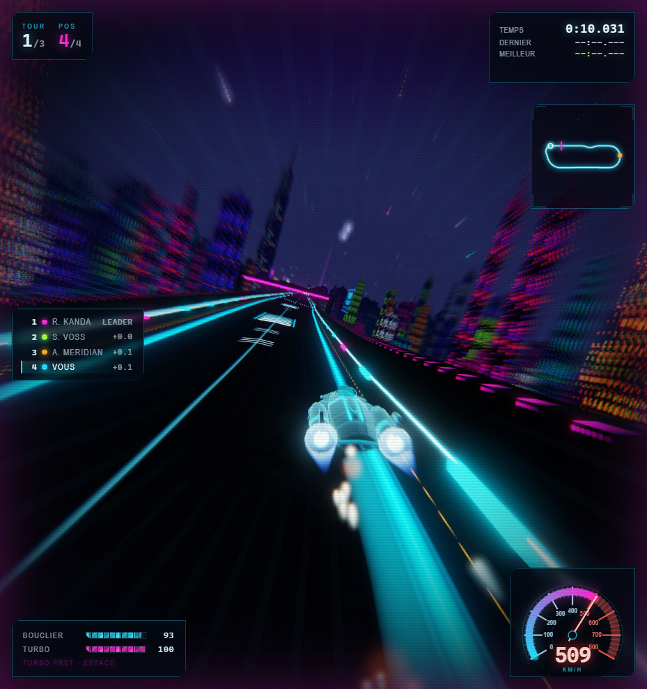

# VELOCITRON

Course anti-gravite dans le navigateur, inspiree de Wipeout. Un circuit
(Circuit Akari, Neo Kyoto), un appareil, trois rivaux, trois tours.

Three.js r169 vendorise, **zero build, zero dependance, zero asset binaire** :
toutes les textures sont peintes dans un canvas 2D, tous les sons sont
synthetises en Web Audio, toute la geometrie est generee en code.



## Lancer

```bash
cd Brainstorming/wipeout
python serve.py            # port 8093
```

Puis ouvrir http://localhost:8093/index.html

`serve.py` envoie `Cache-Control: no-store` : sans ca Chrome garde les modules
ES en cache et on rejoue l'ancien build apres une modification.

`python -m http.server 8093` marche aussi, au prix du cache.

## Commandes (AZERTY)

| Touche | Action |
|---|---|
| `Z` | Accelerer |
| `S` | Freiner / reculer |
| `Q` `D` | Diriger |
| `A` `E` | Aerofreins (virages serres, derapage controle) |
| `ESPACE` | Turbo (consomme de l'energie, se recharge) |
| `R` | Se remettre sur la piste |
| `C` | Camera poursuite / cockpit |
| `M` | Couper le son |
| `ECHAP` | Pause |

Les fleches et `ZQSD` cohabitent, `Shift` gauche/droite double les aerofreins.

## Piloter

Le pilotage n'est pas celui d'une voiture : l'appareil glisse. Un virage
pousse vers l'exterieur proportionnellement au **carre** de la vitesse, et la
direction seule ne suffit pas a le tenir a pleine vitesse : il faut lever le
pied avant l'entree, puis ouvrir a l'aerofrein interieur (`A` a gauche, `E` a
droite) pour pivoter plus vite que le gouvernail ne le permet.

Le devers annule une partie de cette charge : le grand 180 releve a 45 degres
passe beaucoup plus vite que le double apex a plat de la section technique, qui
est le point le plus lent du tour.

Frotter un mur coute du bouclier et beaucoup de vitesse. A zero bouclier
l'appareil explose et repart sur la piste ; `R` remet en piste manuellement mais
ne rend que 35 % de bouclier et se recharge en 3 secondes.

Les chevrons oranges au sol sont des plaques de turbo, elles sont gratuites.
Le turbo `ESPACE` consomme un tiers de la reserve, qui se recharge seule.

Ordre de grandeur : l'IA tourne en 24 s au tour, la pointe est a 521 km/h
(705 km/h sous turbo).

## Architecture

| Fichier | Role |
|---|---|
| `src/config.js` | Toutes les constantes de reglage et la palette |
| `src/textures.js` | Generation procedurale de toutes les textures |
| `src/track.js` | Spline du circuit, frames, geometrie de piste |
| `src/ship.js` | Maillage de l'appareil et physique anti-gravite |
| `src/ai.js` | Pilotes rivaux (ligne de course + profil de vitesse) |
| `src/race.js` | Grille, decompte, tours, checkpoints, classement |
| `src/world.js` | Ciel, ville, lumieres, trafic, decor |
| `src/fx.js` | Particules, reacteurs, trainees, explosions |
| `src/post.js` | Bloom, flou radial, aberration, grain, tonemapping ACES |
| `src/hud.js` | Interface de course (jauge, minimap, classement) |
| `src/input.js` | Clavier |
| `src/main.js` | Assemblage, machine a etats, camera, boucle |
| `docs/CONTRACTS.md` | Contrats de modules (source de verite) |

Le detail des conventions (espace piste `(s, x, h, yaw)`, orientation du
maillage nez vers `-Z`, rendu HDR lineaire puis tonemapping manuel) est dans
`docs/CONTRACTS.md`.

## Debug

`window.game` expose `{ track, ships, race, post, world, audio, hud, renderer, scene, camera }`.
`?debug` dans l'URL active les affichages de mise au point.
