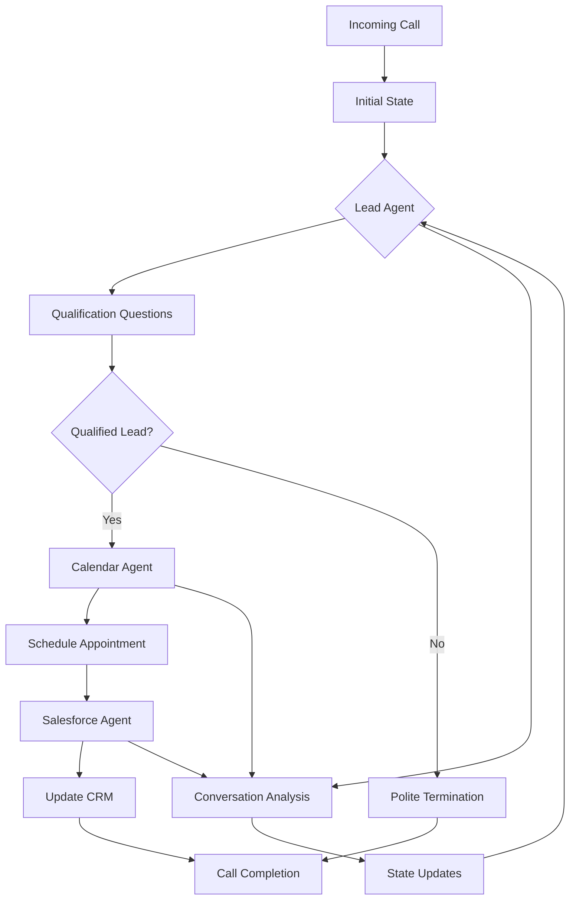

# Agent System

The PIC Prospect Incoming Callbot uses a sophisticated multi-agent system built on LangGraph for orchestrating AI-powered phone conversations. This document details the agent architecture, workflow, and individual agent responsibilities.

## Agent Architecture

### LangGraph State Management
The system uses LangGraph's StateGraph for managing conversation flow and state transitions:

```python
from langgraph.graph import StateGraph
from app.agents.phone_conversation_state_model import PhoneConversationState

# Graph definition in app/agents/agents_graph.py
graph = StateGraph(PhoneConversationState)
```

### State Model
The conversation state is defined in `phone_conversation_state_model.py` and includes:

- **Conversation Context**: Current conversation phase and history
- **User Information**: Collected prospect details
- **Agent Data**: Current active agent and transition history
- **External Data**: CRM records, calendar availability, etc.
- **Audio State**: Current audio processing status

## Agent Workflow



## Individual Agents

### 1. Calendar Agent (`app/agents/calendar_agent.py`)

**Purpose**: Appointment scheduling and calendar management

**Key Responsibilities**:
- Check calendar availability across multiple systems
- Propose meeting times to prospects
- Handle scheduling conflicts and rescheduling
- Confirm appointment details

**Calendar Provider Support**:
- **Salesforce Events**: Using Salesforce Calendar API
- **Google Calendar**: Using Google Calendar API v3
- **Interface-based**: Extensible to other calendar providers

**Configuration**: `app/agents/configs/calendar_agent_config.yaml`

**Key Methods**:
```python
async def check_availability_async(date_range: DateRange) -> List[TimeSlot]
async def schedule_appointment_async(appointment: AppointmentRequest) -> AppointmentConfirmation
async def handle_scheduling_conflict_async(conflict: SchedulingConflict) -> Resolution
```

**Integration Points**:
- `app/api_client/calendar_client_interface.py`: Generic calendar interface
- `app/api_client/google_calendar_client.py`: Google Calendar implementation
- `app/api_client/salesforce_api_client.py`: Salesforce calendar implementation

## Agent Coordination

### State Transitions
Agents coordinate through shared state transitions managed by LangGraph:

```python
# Example transition logic
def route_next_agent(state: PhoneConversationState) -> str:
    if state.lead_qualification_complete and state.lead_quality_score > 7:
        return "calendar_agent"
    elif state.appointment_scheduled:
        return "salesforce_agent"
    else:
        return "lead_agent"
```

### Inter-Agent Communication
Agents share information through the centralized state:

- **Prospect Data**: Collected information available to all agents
- **Conversation History**: Full transcript and context
- **External References**: CRM IDs, calendar event IDs, etc.
- **Agent Metadata**: Previous agent decisions and confidence scores

## Configuration System

### YAML Configuration Files
Each agent has a dedicated configuration file:

```yaml
# lead_agent_config.yaml
qualification_questions:
  - "What's your current biggest challenge with [industry problem]?"
  - "How are you currently handling [specific use case]?"

scoring_criteria:
  budget_available: 3
  decision_maker: 2
  timeline_urgent: 2

minimum_qualification_score: 6
```

### Environment-based Overrides
Configuration can be overridden via environment variables:

```bash
LEAD_AGENT_MIN_QUALIFICATION_SCORE=8
CALENDAR_AGENT_DEFAULT_MEETING_DURATION=30
```

## Advanced Features

### Dynamic Agent Selection
The system can dynamically route to specialized agents based on conversation content:

```python
def select_specialized_agent(conversation_context: str) -> str:
    # NLP analysis to determine best agent
    if "technical requirements" in conversation_context.lower():
        return "technical_agent"
    elif "pricing" in conversation_context.lower():
        return "sales_agent"
    return "lead_agent"
```

### Multi-Modal Processing
Agents can process both text and audio context:

```python
async def process_audio_cues_async(audio_features: AudioFeatures) -> EmotionalState:
    # Analyze tone, pace, emotional indicators
    return analyze_speech_patterns(audio_features)
```

### Learning and Adaptation
Agents can improve over time through:

- **Conversation Analysis**: Success pattern recognition
- **A/B Testing**: Different approach effectiveness
- **Feedback Integration**: Call outcome correlation
- **Prompt Optimization**: Continuous prompt improvement

## Error Handling and Fallbacks

### Graceful Degradation
When an agent encounters errors:

1. **Retry Logic**: Automatic retry for transient failures
2. **Fallback Agents**: Alternative agents for specific failures
3. **Human Escalation**: Transfer to human agent when needed
4. **Safe Termination**: Polite call completion on critical errors

### Error Recovery
```python
async def handle_agent_error(error: AgentError, state: PhoneConversationState) -> PhoneConversationState:
    if error.severity == ErrorSeverity.RECOVERABLE:
        return await retry_with_fallback(error, state)
    else:
        return await initiate_graceful_termination(state)
```

## Performance Considerations

### Concurrent Processing
- **Async Operations**: All agent operations are asynchronous
- **Parallel API Calls**: Simultaneous external API requests
- **Non-blocking I/O**: Efficient resource utilization

### Caching Strategy
- **State Caching**: Frequent state checkpoints
- **API Response Caching**: Reduce external API calls
- **Prompt Caching**: Pre-computed prompt variations

### Monitoring and Metrics
- **Agent Performance**: Response times and success rates
- **State Transitions**: Flow analysis and bottleneck identification
- **Resource Usage**: Memory and CPU utilization per agent

## Testing and Validation

### Agent Testing
```bash
# Test individual agents
pytest tests/agents/test_lead_agent.py
pytest tests/agents/test_calendar_agent.py
pytest tests/agents/test_sf_agent.py

# Integration testing
pytest tests/agents/test_agent_integration.py
```

### Mock External Services
Comprehensive mocking for external dependencies:

```python
@pytest.fixture
def mock_salesforce_client():
    with patch('app.api_client.salesforce_api_client') as mock:
        yield mock
```

This agent system provides a flexible, scalable foundation for handling complex phone conversations while maintaining clear separation of concerns and robust error handling.