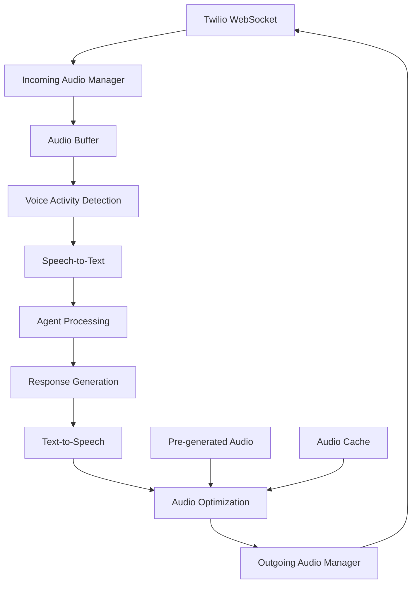

# Audio Processing Architecture

The PIC Prospect Incoming Callbot implements a sophisticated real-time audio processing pipeline optimized for low-latency phone conversations. This document details the audio architecture, processing flow, and optimization strategies.

## Audio Processing Pipeline



## Core Components

### 1. Incoming Audio Manager (`app/managers/incoming_audio_manager.py`)

**Purpose**: Handle real-time audio streams from Twilio WebSocket connections

**Key Features**:
- **WebSocket Audio Handling**: Processes Twilio's WebSocket audio chunks
- **Audio Format Conversion**: Converts between different audio formats
- **Buffer Management**: Manages audio buffers for continuous processing
- **Quality Control**: Monitors audio quality and handles degradation

**Key Methods**:
```python
async def process_audio_chunk_async(audio_chunk: bytes) -> AudioChunk
async def handle_audio_stream_async(websocket: WebSocket) -> None
async def validate_audio_quality_async(audio_data: bytes) -> AudioQuality
```

**Audio Format Specifications**:
- **Sample Rate**: 16 kHz (optimized for speech recognition)
- **Bit Depth**: 16-bit PCM
- **Channels**: Mono (single channel)
- **Encoding**: Linear PCM (uncompressed)

### 2. Outgoing Audio Manager (`app/managers/outgoing_audio_manager.py`)

**Purpose**: Manage audio response generation and delivery

**Key Features**:
- **Response Optimization**: Selects between pre-generated and real-time TTS
- **Audio Queue Management**: Handles multiple concurrent audio responses
- **Streaming Optimization**: Optimizes audio delivery for minimal latency
- **Error Recovery**: Handles audio delivery failures gracefully

**Key Methods**:
```python
async def generate_audio_response_async(text: str, voice_config: VoiceConfig) -> AudioResponse
async def stream_audio_to_client_async(audio_data: bytes, websocket: WebSocket) -> None
async def manage_audio_queue_async(audio_queue: AudioQueue) -> None
```

### 3. Voice Activity Detection (VAD)

**Technology**: WebRTC VAD (Voice Activity Detection)

**Configuration**:
```python
VAD_MODE = 2  # Sensitivity level (0-3, where 3 is most aggressive)
FRAME_DURATION_MS = 30  # Audio frame duration in milliseconds
```

**Detection Logic**:
- **Speech Detection**: Identifies speech segments in audio stream
- **Silence Handling**: Manages silence periods for natural conversation flow
- **Noise Filtering**: Filters background noise and non-speech audio
- **Endpoint Detection**: Detects natural conversation boundaries

### 4. Speech-to-Text Integration (`app/speech/speech_to_text.py`)

**Provider**: Google Cloud Speech-to-Text API

**Configuration**:
```python
SPEECH_CONFIG = {
    'language_code': 'fr-FR',
    'model': 'chirp_3_hd',  # High-definition model for better accuracy
    'use_enhanced': True,
    'enable_automatic_punctuation': True,
    'enable_word_time_offsets': True,
    'sample_rate_hertz': 16000
}
```

**Features**:
- **Streaming Recognition**: Real-time speech-to-text conversion
- **Enhanced Models**: High-definition models for improved accuracy
- **Punctuation**: Automatic punctuation and formatting
- **Word Timing**: Precise word-level timing information
- **Language Detection**: Automatic language detection capabilities

### 5. Text-to-Speech System (`app/speech/text_to_speech.py`)

**Provider**: Google Cloud Text-to-Speech API

**Voice Configuration**:
```python
TTS_CONFIG = {
    'voice_name': 'fr-FR-Chirp3-HD-Zephyr',
    'language_code': 'fr-FR',
    'speaking_rate': 1.0,
    'pitch': 0.0,
    'volume_gain_db': 0.0,
    'audio_encoding': 'LINEAR16',
    'sample_rate_hertz': 16000
}
```

**Optimization Features**:
- **High-Quality Voices**: Premium neural voices for natural speech
- **Speed Control**: Adjustable speaking rate for optimal comprehension
- **Emotional Tone**: Voice modulation based on conversation context
- **Audio Format Optimization**: Format matching for seamless playback

## Pre-generated Audio System

### Purpose
Reduce latency for common responses by pre-generating audio files.

### Storage Structure
```
static/pregenerated_audio/
├── GOOGLE/
│   └── fr-FR-Chirp3-HD-Zephyr/
│       ├── index.json          # Audio file mapping
│       ├── greeting.pcm        # Common greetings
│       ├── confirmation.pcm    # Confirmations
│       └── goodbye.pcm         # Call endings
```

### Audio Index Management
```json
{
    "greeting_formal": {
        "text": "Bonjour, merci d'avoir appelé...",
        "file": "greeting_formal.pcm",
        "duration_ms": 3500,
        "hash": "a1b2c3d4e5f6"
    }
}
```

### Selection Logic
```python
async def select_audio_source_async(text: str) -> AudioSource:
    # Check for pre-generated audio
    if audio_hash := get_pregenerated_hash(text):
        return PreGeneratedAudio(audio_hash)

    # Fall back to real-time TTS
    return RealTimeTTS(text)
```

## Audio Quality Optimization

### Latency Reduction Strategies

1. **Audio Streaming**: Stream audio as it's generated
2. **Buffer Management**: Optimal buffer sizes for smooth playback
3. **Parallel Processing**: Concurrent audio processing and generation
4. **Predictive Loading**: Pre-load likely responses during conversation

### Quality Assurance

**Audio Quality Metrics**:
- **Signal-to-Noise Ratio**: Monitor audio clarity
- **Latency Measurements**: Track end-to-end audio delays
- **Recognition Accuracy**: Monitor STT accuracy rates
- **Playback Quality**: Ensure smooth audio delivery

**Monitoring and Alerts**:
```python
class AudioQualityMonitor:
    async def monitor_audio_quality_async(self, audio_metrics: AudioMetrics) -> None:
        if audio_metrics.snr < MINIMUM_SNR_THRESHOLD:
            await self.alert_audio_degradation_async()

        if audio_metrics.latency > MAXIMUM_LATENCY_THRESHOLD:
            await self.optimize_audio_pipeline_async()
```

## Error Handling and Recovery

### Audio Stream Interruption
```python
async def handle_audio_interruption_async(interruption: AudioInterruption) -> RecoveryAction:
    if interruption.type == AudioInterruptionType.NETWORK:
        return await reconnect_audio_stream_async()
    elif interruption.type == AudioInterruptionType.QUALITY:
        return await adjust_audio_quality_async()
    else:
        return await failover_to_backup_async()
```

### Graceful Degradation
- **Quality Reduction**: Reduce audio quality to maintain connection
- **Buffer Expansion**: Increase buffer size to handle network issues
- **Fallback Systems**: Switch to backup TTS providers if needed
- **User Notification**: Inform users of audio issues when appropriate

## Audio Storage and Management

### File Organization
```
static/
├── incoming_audio/          # Stored incoming call audio
│   └── [call_id]/
│       └── chunks/          # Audio chunks by timestamp
├── outgoing_audio/          # Generated response audio
│   └── [call_id]/
│       └── responses/       # Response audio files
└── pregenerated_audio/      # Pre-generated common responses
    └── [provider]/
        └── [voice]/         # Voice-specific audio files
```

### Cleanup Strategy
```python
async def cleanup_audio_files_async() -> None:
    # Remove old audio files on startup
    await cleanup_directory_async("static/incoming_audio/")
    await cleanup_directory_async("static/outgoing_audio/")

    # Preserve pre-generated audio
    # Keep conversation logs for analysis
```

### Storage Optimization
- **Automatic Cleanup**: Remove old audio files periodically
- **Compression**: Use appropriate compression for storage efficiency
- **Retention Policies**: Define retention periods for different audio types
- **Archive Strategy**: Long-term storage for important conversations

## Performance Considerations

### Real-time Processing Requirements
- **Latency Budget**: Target <500ms total audio processing latency
- **Throughput**: Support multiple concurrent conversations
- **Resource Usage**: Efficient CPU and memory utilization
- **Scalability**: Handle increased call volume gracefully

### Optimization Techniques
```python
class AudioOptimizer:
    async def optimize_audio_pipeline_async(self) -> None:
        # Adjust buffer sizes based on current load
        await self.adjust_buffer_sizes_async()

        # Pre-load commonly used audio responses
        await self.preload_frequent_responses_async()

        # Optimize TTS parameters for speed vs quality
        await self.optimize_tts_parameters_async()
```

## Testing and Validation

### Audio Quality Testing
```bash
# Test audio processing pipeline
pytest tests/audio/test_audio_processing.py

# Test speech recognition accuracy
pytest tests/audio/test_speech_recognition.py

# Test TTS quality and latency
pytest tests/audio/test_text_to_speech.py
```

### Performance Testing
```python
@pytest.mark.asyncio
async def test_audio_latency():
    start_time = time.time()

    # Process audio through full pipeline
    result = await process_audio_pipeline_async(test_audio)

    end_time = time.time()
    latency = end_time - start_time

    assert latency < MAX_ACCEPTABLE_LATENCY
```

### Load Testing
- **Concurrent Calls**: Test multiple simultaneous conversations
- **Audio Quality**: Ensure quality maintained under load
- **Resource Monitoring**: Track CPU, memory, and network usage
- **Failure Recovery**: Test recovery from various failure scenarios

This audio processing architecture ensures high-quality, low-latency audio handling while maintaining scalability and reliability for production phone conversations.