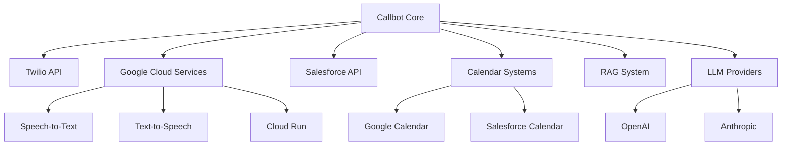

# External Integrations

The PIC Prospect Incoming Callbot integrates with multiple external services to provide comprehensive CRM functionality, calendar management, and knowledge retrieval. This document details all external integrations and their implementations.

## Integration Architecture



## Telephony Integration

### Twilio WebSocket API

**Purpose**: Handle incoming calls and real-time audio streaming

**Implementation**: `app/endpoints.py` and `app/phone_call_websocket_events_handler.py`

**Key Features**:
- **Incoming Call Webhooks**: Handle call initiation and routing
- **WebSocket Audio**: Real-time bidirectional audio streaming
- **Call Control**: Manage call flow and termination
- **SMS Integration**: Send follow-up messages and confirmations

**Configuration**:
```python
TWILIO_CONFIG = {
    'account_sid': 'your_twilio_account_sid',
    'auth_token': 'your_twilio_auth_token',
    'phone_number': 'your_twilio_phone_number',
    'webhook_base_url': 'https://your-domain.com'
}
```

**Webhook Endpoints**:
- `POST /api/callbot/incoming-call` - Handle incoming calls
- `POST /api/callbot/call-status` - Call status updates
- `WS /api/callbot/audio-stream` - WebSocket audio streaming

## Google Cloud Services

### Speech-to-Text API

**Implementation**: `app/speech/speech_to_text.py`

**Features**:
- **Streaming Recognition**: Real-time speech processing
- **Enhanced Models**: High-accuracy speech recognition
- **Multi-language Support**: Configurable language models
- **Custom Vocabulary**: Domain-specific terminology recognition

**Configuration**:
```python
SPEECH_CONFIG = {
    'project_id': 'your-gcp-project',
    'language_code': 'fr-FR',
    'model': 'chirp_3_hd',
    'use_enhanced': True,
    'enable_automatic_punctuation': True
}
```

### Text-to-Speech API

**Implementation**: `app/speech/text_to_speech.py`

**Features**:
- **Neural Voices**: High-quality voice synthesis
- **SSML Support**: Speech Synthesis Markup Language
- **Voice Customization**: Pitch, speed, and volume control
- **Audio Format Options**: Multiple output formats

**Voice Configuration**:
```python
TTS_CONFIG = {
    'voice_name': 'fr-FR-Chirp3-HD-Zephyr',
    'language_code': 'fr-FR',
    'speaking_rate': 1.0,
    'pitch': 0.0,
    'audio_encoding': 'LINEAR16'
}
```

## CRM Integration

### Salesforce API

**Implementation**: `app/api_client/salesforce_api_client.py`

**Interface**: `app/api_client/salesforce_user_client_interface.py`

**Capabilities**:
- **Lead Management**: Create and update prospect records
- **Contact Management**: Manage contact information
- **Opportunity Tracking**: Track sales opportunities and stages
- **Activity Logging**: Log call activities and outcomes
- **Calendar Integration**: Salesforce Events and Lightning Scheduler

**Authentication**:
```python
SALESFORCE_CONFIG = {
    'username': 'your_salesforce_username',
    'password': 'your_salesforce_password',
    'security_token': 'your_salesforce_security_token',
    'domain': 'your_salesforce_domain',
    'api_version': '58.0'
}
```

**Key Operations**:
```python
# Lead management
async def create_lead_async(lead_data: LeadData) -> LeadRecord
async def update_lead_async(lead_id: str, updates: Dict) -> LeadRecord

# Activity logging
async def log_call_activity_async(call_details: CallDetails) -> ActivityRecord

# Opportunity management
async def create_opportunity_async(opp_data: OpportunityData) -> OpportunityRecord
```

## Calendar Systems

### Calendar Client Interface

**Implementation**: `app/api_client/calendar_client_interface.py`

**Purpose**: Provide unified interface for multiple calendar providers

```python
class CalendarClientInterface:
    async def get_availability_async(self, start_date: datetime, end_date: datetime) -> List[TimeSlot]
    async def create_event_async(self, event_data: EventData) -> EventResponse
    async def update_event_async(self, event_id: str, updates: EventUpdates) -> EventResponse
    async def delete_event_async(self, event_id: str) -> bool
```

### Google Calendar Integration

**Implementation**: `app/api_client/google_calendar_client.py`

**Authentication Helper**: `app/utils/google_calendar_auth.py`

**Features**:
- **Calendar Access**: Read and write calendar events
- **Availability Checking**: Check free/busy times
- **Event Management**: Create, update, and delete appointments
- **Timezone Handling**: Multi-timezone support
- **Recurring Events**: Handle recurring appointment patterns

**Configuration**:
```python
GOOGLE_CALENDAR_CONFIG = {
    'credentials_file': 'secrets/google-calendar-credentials.json',
    'calendar_id': 'primary',
    'timezone': 'Europe/Paris',
    'scopes': ['https://www.googleapis.com/auth/calendar']
}
```

**Setup Process**:
1. Create Google Cloud Project
2. Enable Calendar API
3. Create Service Account
4. Download credentials JSON
5. Share calendar with service account email

### Salesforce Calendar Integration

**Implementation**: Part of `app/api_client/salesforce_api_client.py`

**Features**:
- **Events API**: Access Salesforce Events
- **Lightning Scheduler**: Use Salesforce scheduling tools
- **Resource Management**: Manage calendar resources
- **Integration**: Seamless CRM and calendar integration

## Knowledge and RAG System

### RAG Inference API

**Implementation**: `app/api_client/studi_rag_inference_api_client.py`

**Purpose**: Provide domain-specific knowledge retrieval and augmented generation

**Features**:
- **Knowledge Retrieval**: Search company knowledge base
- **Context Augmentation**: Enhance responses with relevant information
- **Semantic Search**: Advanced search capabilities
- **Response Generation**: Generate contextual responses

**Configuration**:
```python
RAG_CONFIG = {
    'inference_url': 'https://your-rag-endpoint.com',
    'api_key': 'your_rag_api_key',
    'timeout': 30,
    'max_retries': 3
}
```

**Key Methods**:
```python
async def query_knowledge_base_async(query: str, context: str) -> KnowledgeResponse
async def generate_augmented_response_async(user_input: str, conversation_history: List[str]) -> str
```

## LLM Provider Integration

### LangChain Factory

**Implementation**: `llms/langchain_factory.py`

**Supported Providers**:
- **OpenAI**: GPT-4, GPT-3.5-turbo
- **Anthropic**: Claude 3.5 Sonnet, Claude 3 Haiku
- **Azure OpenAI**: Enterprise OpenAI models
- **Local Models**: Custom model deployments

**Configuration**:
```python
LLM_CONFIG = {
    'provider': 'openai',  # or 'anthropic', 'azure', etc.
    'model': 'gpt-4',
    'temperature': 0.7,
    'max_tokens': 1000,
    'timeout': 30
}
```

**Factory Pattern**:
```python
def create_llm(provider: str, model: str, **kwargs) -> BaseLLM:
    if provider == 'openai':
        return ChatOpenAI(model=model, **kwargs)
    elif provider == 'anthropic':
        return ChatAnthropic(model=model, **kwargs)
    else:
        raise ValueError(f"Unsupported provider: {provider}")
```

## Integration Patterns

### Error Handling and Resilience

**Retry Logic**:
```python
@retry(
    stop=stop_after_attempt(3),
    wait=wait_exponential(multiplier=1, min=4, max=10),
    retry=retry_if_exception_type(Exception)
)
async def resilient_api_call_async(api_func, *args, **kwargs):
    return await api_func(*args, **kwargs)
```

**Circuit Breaker Pattern**:
```python
class APICircuitBreaker:
    def __init__(self, failure_threshold: int = 5, timeout: int = 60):
        self.failure_count = 0
        self.failure_threshold = failure_threshold
        self.timeout = timeout
        self.last_failure_time = None

    async def call_async(self, func, *args, **kwargs):
        if self.is_open():
            raise CircuitBreakerOpenError("Circuit breaker is open")

        try:
            result = await func(*args, **kwargs)
            self.on_success()
            return result
        except Exception as e:
            self.on_failure()
            raise e
```

### Authentication Management

**Service Account Management**:
```python
class ServiceAccountManager:
    async def get_authenticated_client_async(self, service: str) -> Any:
        credentials = await self.load_credentials_async(service)
        return await self.create_authenticated_client_async(service, credentials)

    async def refresh_credentials_async(self, service: str) -> None:
        # Handle credential refresh for various services
        pass
```

**API Key Rotation**:
```python
async def rotate_api_keys_async():
    for service in ['twilio', 'openai', 'salesforce']:
        await rotate_service_key_async(service)
```

### Rate Limiting

**Implementation**:
```python
class RateLimiter:
    def __init__(self, max_calls: int, time_window: int):
        self.max_calls = max_calls
        self.time_window = time_window
        self.calls = []

    async def acquire_async(self) -> bool:
        now = time.time()
        # Remove old calls outside time window
        self.calls = [call_time for call_time in self.calls if now - call_time < self.time_window]

        if len(self.calls) < self.max_calls:
            self.calls.append(now)
            return True
        return False
```

## Monitoring and Observability

### Integration Health Checks

```python
async def check_integration_health_async() -> Dict[str, bool]:
    health_status = {}

    # Check each integration
    health_status['twilio'] = await check_twilio_health_async()
    health_status['google_cloud'] = await check_google_cloud_health_async()
    health_status['salesforce'] = await check_salesforce_health_async()
    health_status['rag_system'] = await check_rag_system_health_async()

    return health_status
```

### Performance Metrics

**Key Metrics**:
- API response times
- Error rates by service
- Authentication success rates
- Rate limit utilization
- Data synchronization lag

**Monitoring Implementation**:
```python
class IntegrationMonitor:
    async def log_api_call_async(self, service: str, endpoint: str, duration: float, success: bool):
        metrics = {
            'service': service,
            'endpoint': endpoint,
            'duration_ms': duration * 1000,
            'success': success,
            'timestamp': datetime.utcnow()
        }
        await self.send_metrics_async(metrics)
```

## Security Considerations

### Credential Security
- **Environment Variables**: Store non-sensitive configuration
- **Secret Files**: Secure storage for API keys and credentials
- **Encryption**: Encrypt sensitive data at rest and in transit
- **Access Control**: Limit access to integration credentials

### API Security
- **HTTPS Only**: All API communications over HTTPS
- **Authentication**: Proper authentication for all services
- **Authorization**: Minimum required permissions
- **Audit Logging**: Log all external API interactions

### Data Privacy
- **PII Handling**: Proper handling of personally identifiable information
- **Data Retention**: Appropriate data retention policies
- **Compliance**: GDPR, CCPA, and other regulatory compliance
- **Data Minimization**: Collect and store only necessary data

This comprehensive integration architecture ensures reliable, secure, and scalable connections to all external services while maintaining proper error handling, monitoring, and security practices.