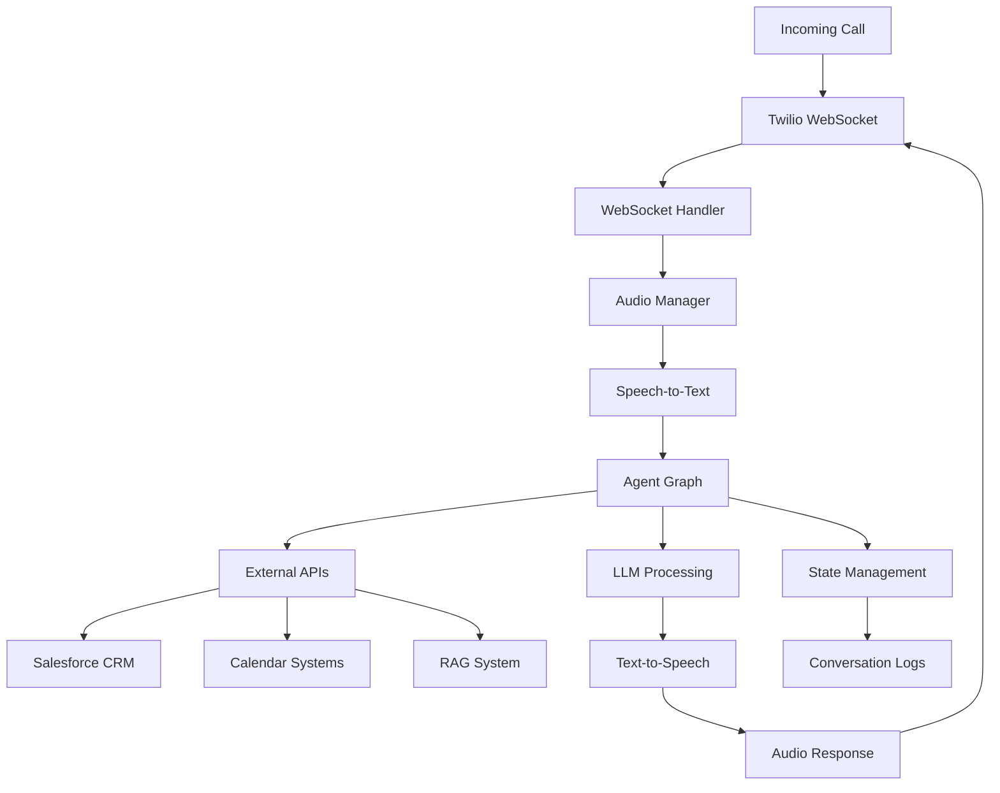

# Architecture Overview

The PIC Prospect Incoming Callbot is designed as a scalable, AI-powered phone conversation system. This document provides a high-level overview of the system architecture and key components.

## System Architecture Diagram

## Core Components

### 1. Telephony Layer
- **Twilio Integration**: Handles incoming calls and WebSocket audio streaming
- **WebSocket Management**: Real-time bidirectional audio communication
- **Audio Processing**: Manages incoming and outgoing audio streams

### 2. Speech Processing Pipeline
- **Speech-to-Text**: Google Cloud Speech API with streaming recognition
- **Voice Activity Detection**: WebRTC VAD for detecting speech segments
- **Text-to-Speech**: Google Cloud TTS with pre-generated audio optimization
- **Audio Optimization**: Pre-generated responses for common phrases

### 3. AI Agent System
- **LangGraph Orchestration**: State-based agent workflow management
- **Specialized Agents**:
  - Lead Agent: Prospect qualification and information gathering
  - Calendar Agent: Appointment scheduling and management
  - Salesforce Agent: CRM data integration and updates
- **State Management**: Persistent conversation state across interactions

### 4. LLM Integration
- **LangChain Framework**: Unified interface for multiple LLM providers
- **Provider Support**: OpenAI GPT-4, Anthropic Claude, and others
- **Prompt Management**: Structured prompt templates and chain composition
- **Context Management**: Conversation history and context preservation

### 5. External Integrations
- **Salesforce CRM**: Lead management, contact updates, opportunity tracking
- **Calendar Systems**: Google Calendar and Salesforce Events integration
- **RAG System**: Retrieval-augmented generation for domain knowledge
- **Knowledge Base**: Company-specific information and responses

## Data Flow

### Incoming Call Processing
1. **Call Initiation**: Twilio receives incoming call and establishes WebSocket connection
2. **Audio Streaming**: Real-time audio chunks streamed to the application
3. **Speech Recognition**: Audio converted to text using Google Cloud Speech
4. **Agent Processing**: Text processed through LangGraph agent workflow
5. **Intent Recognition**: Agent determines appropriate response and actions
6. **External API Calls**: Integration with CRM, calendar, or knowledge systems
7. **Response Generation**: LLM generates contextual response
8. **Audio Synthesis**: Text converted to speech and streamed back to caller

### State Management
- **Conversation State**: Maintained throughout the call duration
- **Agent Context**: Persistent across agent transitions
- **External Data**: Cached API responses and user information
- **Audio History**: Stored for quality assurance and training

## Technology Stack

### Backend Framework
- **FastAPI**: High-performance web framework with automatic API documentation
- **Python 3.11+**: Modern Python with type hints and async support
- **asyncio**: Asynchronous processing for concurrent operations

### AI and Machine Learning
- **LangGraph**: Agent orchestration and state management
- **LangChain**: LLM integration and prompt management
- **Google Cloud AI**: Speech-to-Text and Text-to-Speech services
- **OpenAI/Anthropic**: Large language models for conversation

### Audio Processing
- **WebRTC VAD**: Voice activity detection for speech segmentation
- **PCM Audio**: Raw audio format for real-time processing
- **Audio Streaming**: Continuous audio processing with minimal latency

### External Services
- **Twilio**: Telephony services and WebSocket communication
- **Google Cloud Platform**: Speech services and deployment infrastructure
- **Salesforce**: CRM integration and data management
- **Various Calendar APIs**: Multi-provider calendar integration

## Scalability Considerations

### Horizontal Scaling
- **Stateless Design**: Each call handled independently
- **Microservice Architecture**: Loosely coupled components
- **Load Balancing**: Multiple instances for high availability
- **Auto-scaling**: Dynamic resource allocation based on demand

### Performance Optimization
- **Audio Pre-generation**: Common responses pre-converted to audio
- **Caching Strategy**: API responses and frequently accessed data
- **Async Processing**: Non-blocking I/O for concurrent operations
- **Resource Management**: Efficient memory and CPU utilization

### Reliability
- **Error Handling**: Graceful degradation and fallback mechanisms
- **Health Monitoring**: Comprehensive health checks and metrics
- **Logging**: Detailed logging for debugging and audit trails
- **Backup Systems**: Redundancy for critical components

## Security Architecture

### Authentication
- **Service Account Authentication**: Google Cloud and Salesforce
- **API Key Management**: Secure storage and rotation of credentials
- **WebSocket Security**: Secure WebSocket connections with validation

### Data Protection
- **Encryption**: Data encrypted in transit and at rest
- **PII Handling**: Proper handling of personally identifiable information
- **Audit Logging**: Comprehensive audit trails for compliance
- **Access Control**: Role-based access to sensitive operations

## Deployment Architecture

### Development
- **Local Development**: uvicorn with hot reload
- **Testing Environment**: Docker containers for isolation
- **CI/CD Pipeline**: Automated testing and deployment

### Production
- **Google Cloud Run**: Serverless container deployment
- **Docker Containers**: Consistent deployment environment
- **Load Balancing**: Traffic distribution and failover
- **Monitoring**: Application and infrastructure monitoring

## Configuration Management

### Environment-based Configuration
- **Development**: Local configuration with debug features
- **Staging**: Production-like environment for testing
- **Production**: Optimized configuration for performance and security

### Secret Management
- **Environment Variables**: Non-sensitive configuration
- **Secret Files**: Sensitive credentials and API keys
- **Runtime Configuration**: Dynamic configuration updates

This architecture provides a robust, scalable foundation for handling AI-powered phone conversations while maintaining high performance, reliability, and security standards.